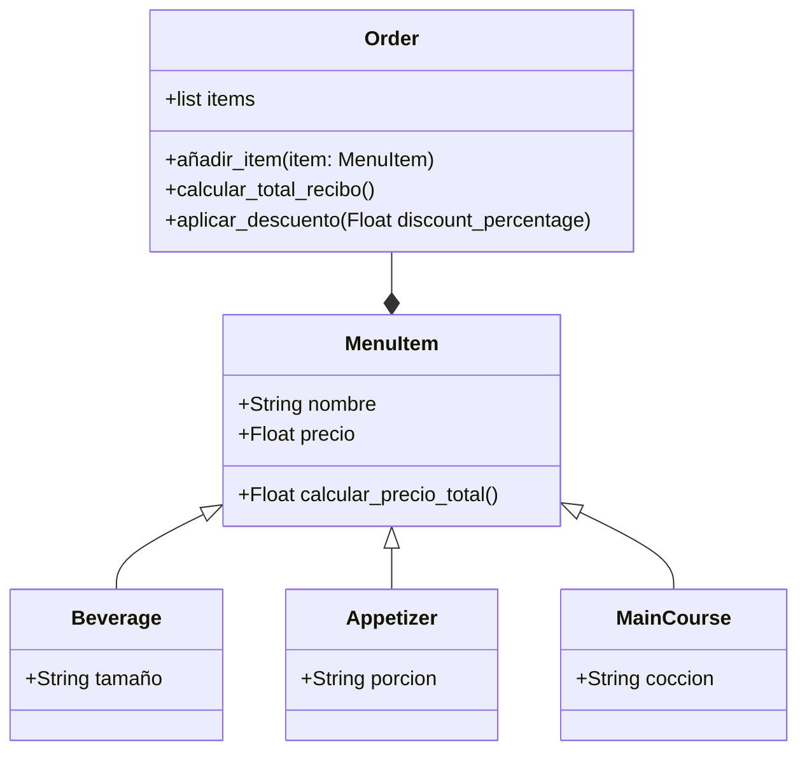

# reto_3

- The first thing I did was making the class diagram of the exercise in mermaid:


```python
- Once I had the idea, started developing the code in visual studio:
import math


class Point:
    def __init__(self, x, y):
        self.x = x
        self.y = y


class Line:
    def __init__(self, start, end):
        self.start = start
        self.end = end
        self.length = self.compute_length()
        self.slope = self.compute_slope()

    def compute_length(self):
        return math.sqrt(
            (self.end.x - self.start.x) ** 2 + (self.end.y - self.start.y) ** 2
        )

    def compute_slope(self):
        if self.end.x - self.start.x != 0:
            return math.degrees(
                math.atan((self.end.y - self.start.y) / (self.end.x - self.start.x))
            )
        else:
          return None
      
    def compute_horizontal_cross(self):
        if self.start.y * self.end.y <= 0:
            return True
        else:
            return False
        
    def compute_vertical_cross(self):
        if self.start.x * self.end.x <= 0:
            return True
        else:
            return False
        
class Rectangle:
    def __init__(self, line1, line2, line3, line4):
        self.lines = [line1, line2, line3, line4] 
        
        
#uso

punto1 = Point(0, 0)
punto2 = Point(3, 4)
linea1 = Line(punto1, punto2)

print(f"longitud: {linea1.length}")
print(f"pendiente: {linea1.slope}")
print(f"cruza eje x: {linea1.compute_horizontal_cross()}")
print(f"cruza eje y: {linea1.compute_vertical_cross()}")
